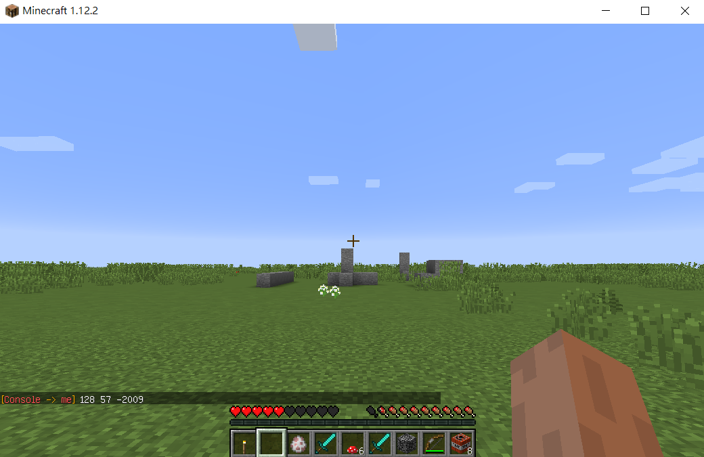

# 重生點

### 使用 CodingBar 連接 Minecraft 世界

```python
from CBMC import *
```

### 連接你的角色！

```python
mc = CBMC('janice_kuo',"minecraft.codingbar.ai")
```

* mc 👉 儲存角色資訊
* janice\_kuo 👉 放入你的角色名稱
* minecraft.codingbar.ai 👉 伺服器地址

### 找到一個點



```python
from CBMC import *
mc = CBMC('janice_kuo',"minecraft.codingbar.ai")

mc.setSpawnPoint()
```


